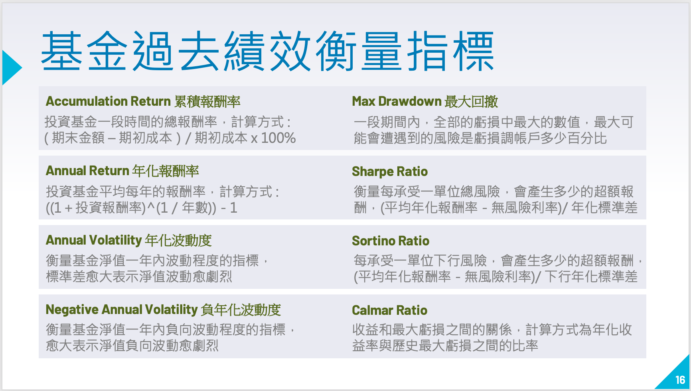
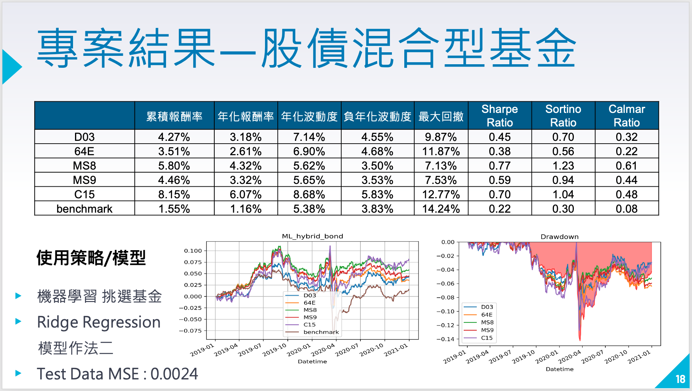

# 永豐金控-AI挑選最佳基金

```
課程名稱：東吳大學Ｘ台灣大學 金融科技
時間：2021 Spring
指導老師 戴天時 教授
指導業師 周尚民 經理

團隊成員：
1. 江祐宏（東吳大學 財務工程與精算數學系）
2. 李瑀晨（台灣大學 財務金融所）
3. 張軒羽（東吳大學 巨量資料科學系）
4. 楊詠淇（台灣大學 財務金融系）
```

- [專案成果](#專案成果)
  - [宣傳廣告影片](#宣傳廣告影片)
  - [完整說明影片](#完整說明影片)
  - [書面報告](#書面報告)


- [專案概要](#專案概要)
  - [問題介紹](#問題介紹)
  - [主要方法](#主要方法)
  - [傳統法則挑選基金](#傳統法則挑選基金)
  - [機器學習挑選基金](#機器學習挑選基金)
  - [績效評估](#績效評估)
  - [專案成果](#專案成果)

  

# 專案成果


## 宣傳廣告影片

[](https://youtu.be/GyuDfw4FKzg)

## 完整說明影片

[](https://youtu.be/9TEgCBaxdiM)


## 書面報告

### [專案簡報](Report/FinalReport.pdf)


### [專案結果彙整](Report/FinalResult.xlsx)


# 專案概要

## 問題介紹 

當面臨投資的時候很多人往往不知道該從何下手、毫無頭緒，因而有了4433等篩選基金的法則，但是這些方法未經證實且複雜，而隨著科技的發達、人工智慧的出現讓我們對於投資有了更多不同的選擇，因此我們希望能透過人工智慧的方式在過往的資料當中找出規律，並且為所有的投資人找出一個最理想的基金。


## 主要方法 

我們先將基金分成了十二個類別，例如：科技型基金、股債混合型基金等等，再用各種不同的傳統策略以及演算法模型，在每一個類別都挑選出績效最好的一個方法，並且與該類別的所有基金之平均績效進行比較。


## 傳統法則挑選基金

依據基金過去的表現，挑選預期未來有潛力的基金，我們在這邊用了兩個Rule-based策略，分別是4433法則及3163法則。我們依據法則挑選符合條件的基金，再選取sharpe ratio最高的五檔基金。


## 機器學習挑選基金

利用處理後的淨值資料計算報酬率後，計算出13個特徵值，將特徵值進行特徵工程。模型所使用的特徵工程為PCA主成份分析及StandardScaler標準化，主要目的是篩選出關鍵的特徵值，讓模型能夠快速收斂。再將特徵值丟入設計好的模型中訓練，並使用模型預測基金報酬率並選出未來報酬率最高的五檔基金。


## 績效評估



## 專案成果




> [回目錄](#永豐金控-AI挑選最佳基金)
