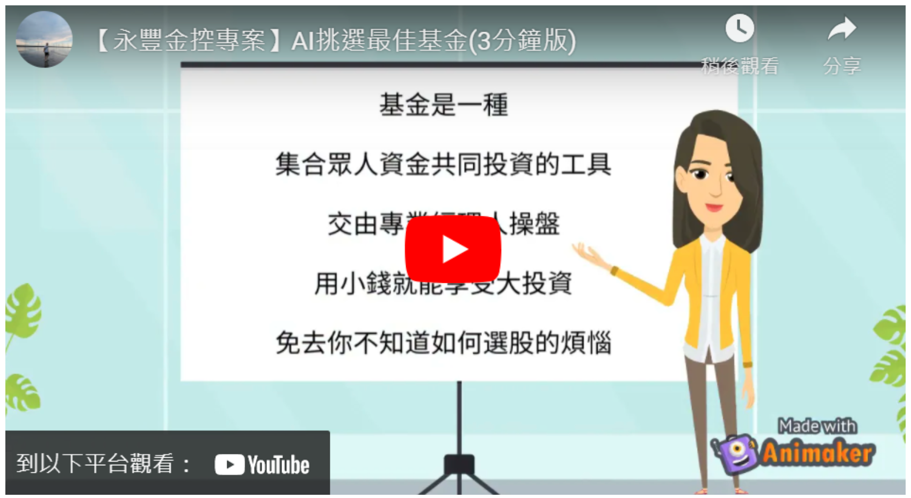
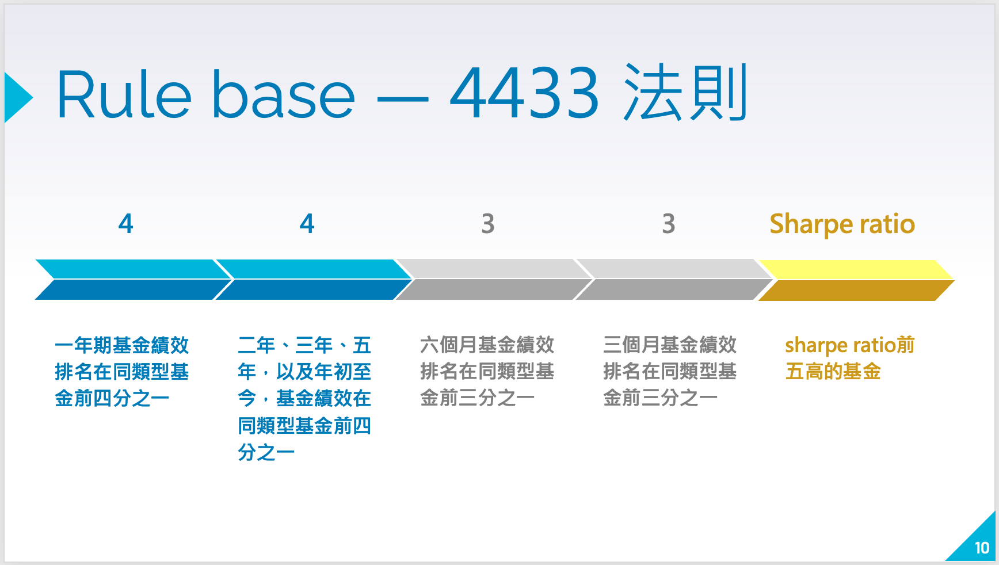
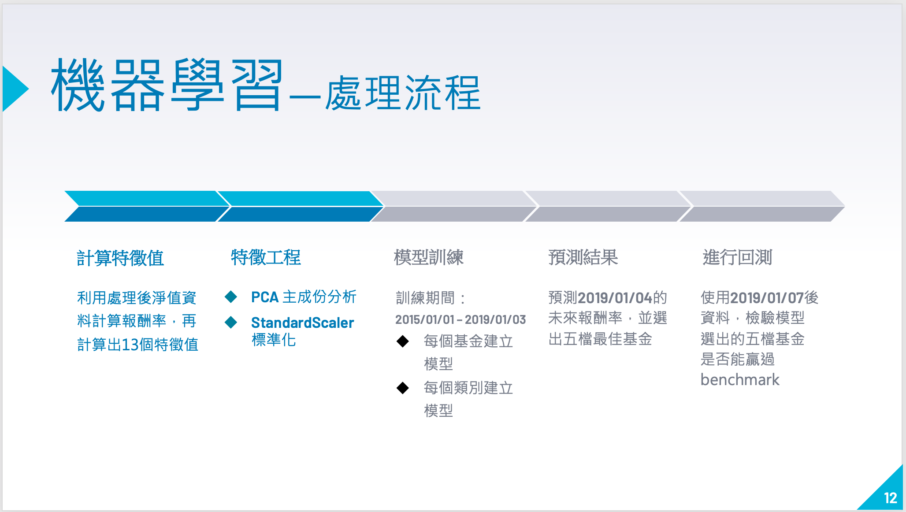
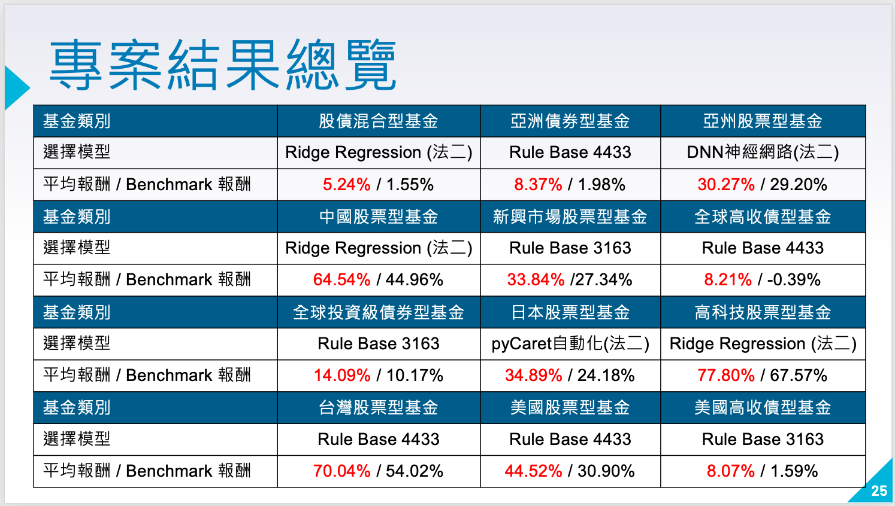

# 永豐金控－AI挑選最佳基金

```
課程名稱：東吳大學Ｘ台灣大學 金融科技
時間：2021 Spring
指導老師 戴天時 教授
指導業師 周尚民 經理

團隊成員：
1. 江祐宏（東吳大學 財務工程與精算數學系）
2. 李瑀晨（台灣大學 財務金融所）
3. 張軒羽（東吳大學 巨量資料科學系）
4. 楊詠淇（台灣大學 財務金融系）
```

- [專案成果](#專案成果)
  - [宣傳廣告影片](#宣傳廣告影片)
  - [完整說明影片](#完整說明影片)
  - [書面報告](#書面報告)


- [專案概要](#專案概要)
  - [問題介紹](#問題介紹)
  - [研究流程](#研究流程)
  - [挑選基金的策略](#挑選基金的策略)

- [結論](#結論)


# 專案成果

## 宣傳廣告影片

[](https://youtu.be/GyuDfw4FKzg)

## 完整說明影片

[](https://youtu.be/9TEgCBaxdiM)


## 書面報告

### [專案簡報](Report/FinalReport.pdf)

### [專案結果彙整](Report/FinalResult.xlsx)


# 專案概要

## 問題介紹 
在購買基金的時候，很多人往往不知道該從何下手，因為基金的項目和種類實在太多。因此，有了 4433 等篩選基金的法則；但是這些方法是否真的能挑選到好基金，又是一個很大的疑問。隨著科技的發達，讓我們對於投資有了更多不同的選擇與機會。我們希望透過人工智慧的方式，從過往的資料中找出規律並分析，為所有的投資人挑選到最理想的基金。


## 研究流程
我們認為，不同類別的基金有著不同的特性（例如：投資級債券的波動比股票型還要低）；因此，我們將基金分成十二類，並運用傳統法則與機器學習的方式（共十一種）挑選基金做回測，期望在每個類別中找到至少一種「能夠挑選到好基金的方法」。

1. 分類基金－將所有基金分成「全球高收益債」等十二個類別
2. 研究方法－統整出包含「傳統法則」與「機器學習」共十一種挑選基金的策略
3. 策略回測－將十一個策略都用於每一類別中進行回測
4. 績效評估－使用「夏普指數」等績效衡量的指標
5. 專案呈現－統整結果，並列舉出每一類別最好的策略之詳細資訊


## 挑選基金的策略
以下簡略介紹兩種挑選基金的策略，分別為「傳統法則」與「機器學習」

### 傳統法則
依據基金過去的表現做層層篩選，找出預期未來表現良好的基金，如附圖中的「4433 法則」

1. 挑選出一年期績效排名前四分之一的基金
2. 挑選出二年、三年、五年、年初至今績效排名前四分之一的基金
3. 挑選出六個月績效排名前三分之一的基金
4. 挑選出三個月績效排名前三分之一的基金
5. 取其中「夏普指數」最高的五檔基金




### 機器學習
**第一步 計算特徵值**：用基金淨值計算出 13 個具有預測能力的參數，作為特徵值

**第二步 特徵工程**：將特徵值做主成份分析與標準化，讓之後的模型較不容易發生過度配適的情形

**第三步 模型訓練**：將準備好的特徵值 X 與預測項 Y 丟入監督式學習的模型中做訓練

> 作法一：每一檔基金都建立自己的預測模型
> 
> 此方法假設，每一檔基金跟「同類別中的其他基金」數據行為仍會有些差異，因此不能把全部樣本都放在一起建模，怕會彼此干擾

> 作法二：一個類別建立一個共同的預測模型
> 
> 此方法假設，「同類別的基金」數據行為已經大致相似，我們可以透過非常大量的樣本，做出一個較為精密的模型

**第四步 預測結果**：將 2019/1/4 計算出的參數，放入做好的模型中進行預測，並挑選出預期報酬率最高的五檔基金作為投資標的

**第五步 回測**：繪製「這五檔基金」以及「該類別基金平均績效（大盤）」的權益圖，並計算績效指標




# 結論
本次專題，我們依據回測結果與績效評估指標，分別找出在「十二個基金類別」中挑選基金最好的一個策略，並能夠持續落地應用於未來的標的選擇。在績效上與模型重複利用的程度有符合我們的期待，也能夠提供充足的歷史回測結果供投資人參考。然而，由於我們團隊成員皆對機器學習較為不熟悉，因此在「模型訓練」上仍有相當大的優化空間；此外，歷史不等同於未來，我們應當做更多次的績效模擬，並觀察市場結構是否改變，以做出更穩定的好模型，讓投資人對我們團隊有更大的信任感，這些都是未來可以持續努力的地方。



> 詳細的說明與專案結果彙整請參考：[專案簡報](Report/FinalReport.pdf) 與 [專案結果彙整](Report/FinalResult.xlsx)
